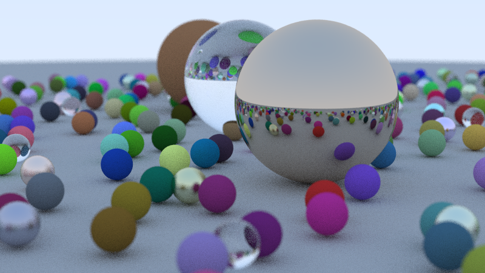

# Zig GPU Raytracer

A real-time GPU path tracer built in Zig using OpenGL 4.3 compute shaders. Features a **demo canvas mode** inspired by Dota 2's demo mode - a sandbox environment where you can spawn objects, experiment with materials, and tweak effects in real-time.



> **Warning**
> This application performs intensive GPU computations. Running at high resolutions or with many effects enabled can cause significant GPU load, high temperatures, and potential system instability. Monitor your GPU temperatures and use quality presets (keys 1-4) to manage performance. **Use at your own risk.**

## Features

### Core
- **Scene Save/Load** - JSON format with full camera and object state
- **Image Export** - PNG, BMP, HDR formats with file dialogs
- **Shader Hot Reload** - Edit shader.glsl externally, auto-recompiles
- **Performance Profiler** - Real-time timing breakdown in console
- **Undo/Redo** - Full history for scene modifications
- **30+ Material Presets** - Metals, glass, diffuse, emissive, SSS

### Rendering
- Real-time path tracing with progressive accumulation
- BVH acceleration for spheres, triangles, and mesh instances
- Constructive Solid Geometry (CSG) with ray marching
- OBJ model loading with per-mesh BVH
- Demo canvas mode for experimentation

### Materials
- Diffuse (Lambertian)
- Metal with configurable roughness
- Glass/Dielectric with refraction
- Emissive lights
- Subsurface scattering (SSS)

### Lighting
- HDR sky with physically-based atmospheric scattering
- Direct sun lighting
- Area lights
- Next Event Estimation (NEE) for faster convergence

### Post-Processing
- ACES filmic tone mapping
- Chromatic aberration
- Motion blur
- Bloom
- Vignette
- Depth of field
- Lens flares
- Denoising (spatial + variance-guided)
- CRT scanlines
- Fisheye distortion
- Heat haze
- Film grain
- Night vision, thermal, underwater effects
- Kaleidoscope, pixelate, halftone, VHS
- And many more...

### UI
- **Dota 2-style HUD** with tabbed interface (Spawn, Effects, Camera, Debug, Settings)
- **Settings tab** with resolution presets (720p, 1080p, 1440p, 4K), quality presets, debug modes
- **Auto-detect native resolution** - starts at your monitor's native resolution
- **Debug Console** (`~` key) showing all scene objects, active effects, and camera info
- Real-time FPS and performance stats

## Controls

### File Operations
| Key | Action |
|-----|--------|
| `Ctrl+N` | New scene |
| `Ctrl+O` | Open scene |
| `Ctrl+S` | Save scene |
| `Ctrl+E` | Export image |
| `Ctrl+Z` | Undo |
| `Ctrl+Y` | Redo |

### Camera
| Key | Action |
|-----|--------|
| `WASD` | Move camera |
| `Space/Ctrl` | Up/Down |
| `Right-click` | Toggle mouse look |
| `P` | Toggle flight mode (6DOF) |
| `Q/E` | Roll (flight mode only) |

### UI & Debug
| Key | Action |
|-----|--------|
| `TAB` | Toggle HUD overlay |
| `~` (tilde) | Toggle debug console |
| `1-5` | Switch HUD tabs (Spawn, Effects, Camera, Debug, Settings) |
| `F12` | Screenshot |
| `R` | Reset all settings |
| `ESC` | Exit |

### Effects (Shift+Key to decrease)
| Key | Effect |
|-----|--------|
| `B` | Bloom |
| `E` | Exposure |
| `C` | Chromatic aberration |
| `V` | Vignette |
| `M` | Motion blur |
| `G` | Film grain |
| `L` | Lens flare |
| `X` | Heat haze |

### Debug Visualization
| Key | Mode |
|-----|------|
| `5` | Normal rendering |
| `6` | BVH heatmap |
| `7` | Normals visualization |
| `8` | Depth visualization |

### Lens Controls
| Key | Action |
|-----|--------|
| `F/G` | FOV decrease/increase |
| `T/Y` | Aperture (DOF) |
| `U/I` | Focus distance |

## Requirements

- **Zig**: 0.16 or later
- **GPU**: OpenGL 4.3 compatible (NVIDIA GTX 600+, AMD GCN+, Intel HD 5000+)
- **OS**: Windows (native Win32)

## Building

```bash
zig build -Doptimize=ReleaseFast
```

## Running

```bash
zig-out/bin/zig-raytracer.exe
```

Place OBJ models in the `models/` folder and run from the project directory.

## Project Structure

```
zig-raytracer/
├── src/
│   ├── main.zig           # Window, input, render loop, scene management
│   ├── shader.zig         # GLSL compute shader (embedded)
│   ├── types.zig          # GPU structs (spheres, triangles, BVH nodes, CSG)
│   ├── bvh.zig            # BVH construction for acceleration
│   ├── hud.zig            # Dota 2-style HUD + debug console
│   ├── scene.zig          # Demo canvas mode, object spawning
│   ├── vec3.zig           # Vector math utilities
│   ├── obj_loader.zig     # OBJ file loading
│   ├── settings.zig       # Persistent settings (settings.json)
│   ├── scene_io.zig       # Scene save/load (JSON format)
│   ├── export.zig         # Image export (PNG/BMP/HDR)
│   ├── shader_loader.zig  # Shader hot reload
│   ├── profiler.zig       # Performance profiler
│   ├── console.zig        # Debug console commands
│   ├── materials.zig      # 30+ material presets
│   ├── history.zig        # Undo/redo system
│   ├── camera_presets.zig # Camera bookmarks
│   ├── shortcuts.zig      # Keyboard shortcut reference
│   └── welcome.zig        # First-time user tips
├── models/                # OBJ files
├── build.zig              # Build configuration
├── LICENSE                # MIT License
├── SECURITY.md            # Security policy
├── ROADMAP.md             # Development roadmap
├── FOR_CLAUDE.md          # Context for AI assistants
└── README.md
```

## Performance Tips

- Use quality presets `1-4` to balance quality vs FPS
- Change resolution from Settings tab (720p for best FPS, 4K for best quality)
- Disable expensive effects (chromatic aberration, motion blur)
- Monitor GPU temperature during extended use

Auto-detects native screen resolution at startup. Tested on RTX 3090.

## License

This project is licensed under the MIT License - see the [LICENSE](LICENSE) file for details.
